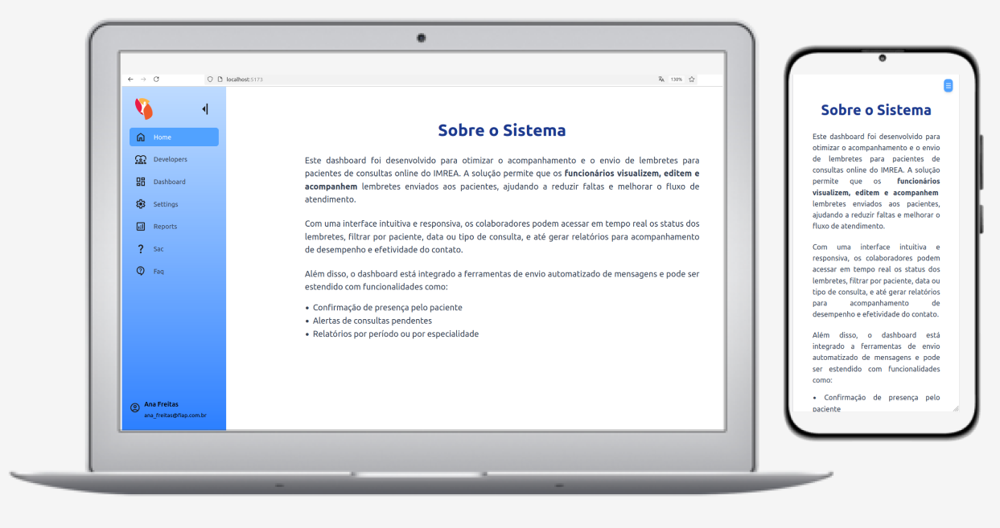
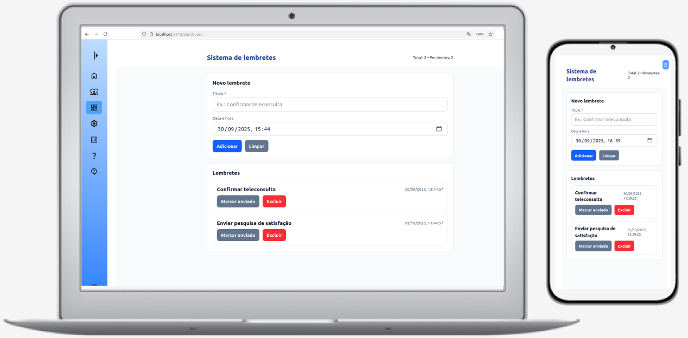
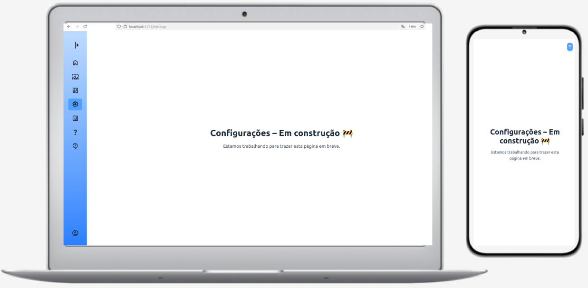
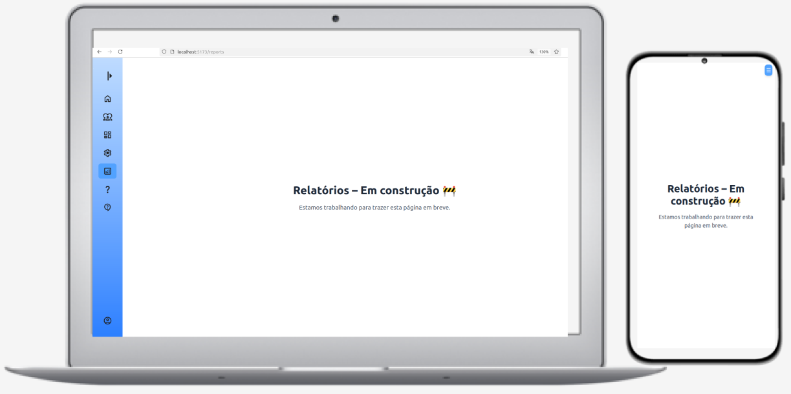
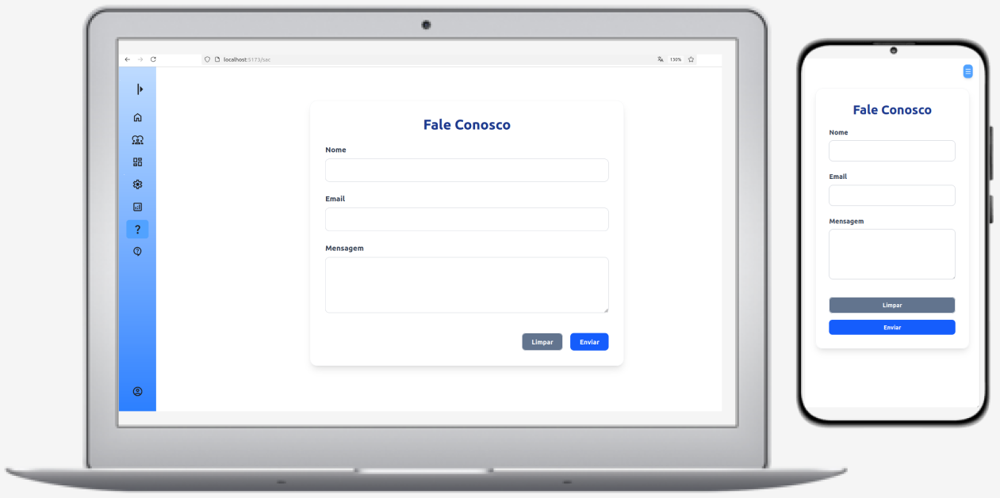
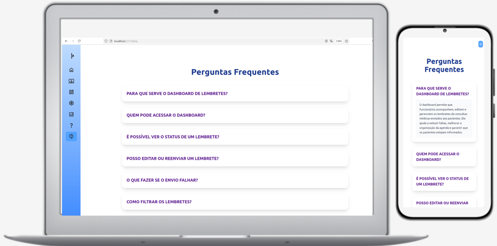

# 📌 Projeto Sistema de Lembretes de Consultas

Sistema de lembretes para consultas médicas, com foco em acessibilidade, clareza e responsividade. Permite o envio e gerenciamento de lembretes baseados em dados de consultas já cadastradas, promovendo organização e redução de faltas.

---

## 🚀 Tecnologias Utilizadas

- [React](https://reactjs.org/)
- [TypeScript](https://www.typescriptlang.org/)
- [Vite](https://vitejs.dev/)
- [Tailwind CSS](https://tailwindcss.com/)
- [React Hook Form](https://react-hook-form.com/)
- [Zod](https://zod.dev/)
- [React Router DOM](https://reactrouter.com/)
- [VS Code](https://code.visualstudio.com/)

---

## 👥 Integrantes

| Nome        | RM     | Curso / Turma                               |
|-------------|--------|---------------------------------------------|
| Ana Freitas | 565559 | Análise e Desenvolvimento de Sistemas - FIAP |

---

## 🖼️ Imagens & Ícones do Projeto

**Layout das páginas**  









**Ícones utilizados:**  
- Utilizados para o menu onde cada item do menu tem um icone.
- Utilizados na pagina desenvolvedores, com icone do Github e LinkedIn
- Todos os icones utilizados estão na pasta assets, sendo em sua maior parte arquivos svg.


---

## 📁 Estrutura de Pastas

```
src/
├── assets/                 # Imagens e ícones
├── components/             # Componentes reutilizáveis
│   │   ├── Button.tsx
│   │   ├── Sidebar.tsx
│   │   ├── SidebarFooter.tsx
│   │   ├── SidebarHeader.tsx
│   │   └── SidebarItems.tsx
├── pages/                  # Páginas principais
│   ├── Dashboard.tsx
│   ├── Developers.tsx
│   ├── Faq.tsx
│   ├── Home.tsx
│   ├── Logs.tsx
│   ├── Reports.tsx
│   ├── Sac.tsx
│   ├── Settings.tsx
│   └── UnderConstrution.tsx
├── App.tsx                 # Componente principal
├── main.tsx                # Ponto de entrada da aplicação
├── index.css               # Estilização base com Tailwind
└── Routes.tsx              # Configuração de rotas
```

## ⚙️ Instalação e Execução

### 1. Clone o repositório

```bash

git clone https://github.com/A2L-Solutions-Challenge-FIAP/Sprint-4.git

```

### 2. Navegue até o diretório do projeto
```bash

cd Sprint-4

```

### 3. Instale as dependências
```bash

npm install

```

Se necessário, instale também:

# Bibliotecas para validação de formulários
```bash

npm install react-hook-form zod @hookform/resolvers

```

# Roteamento
```bash
npm install react-router-dom
```

# Tailwind CSS e plugins
```bash

npm install -D tailwindcss @tailwindcss/forms

```

# Tipagens (em caso de erro com TypeScript)
```bash

npm install -D @types/react @types/react-dom

```

### 4. Execute o projeto em ambiente de desenvolvimento

``` bash

npm run dev 

```
acesse pelo navegador o link que aparecerá como este http://localhost:5173/
---

## 🔗 Links Importantes

- [📂 Repositório GitHub](https://github.com/A2L-Solutions-Challenge-FIAP/Sprint-4.git)
- [📹 Vídeo de Demonstração (YouTube)](https://youtube.com/meuvideo)

## Observações finais

- As páginas Settings, Login e Reports ainda estão em construção.
- O projeto pode ser expandido com autenticação real e integração com banco de dados no futuro.
- Totalmente responsivo e adaptado para uso em desktop e mobile.
